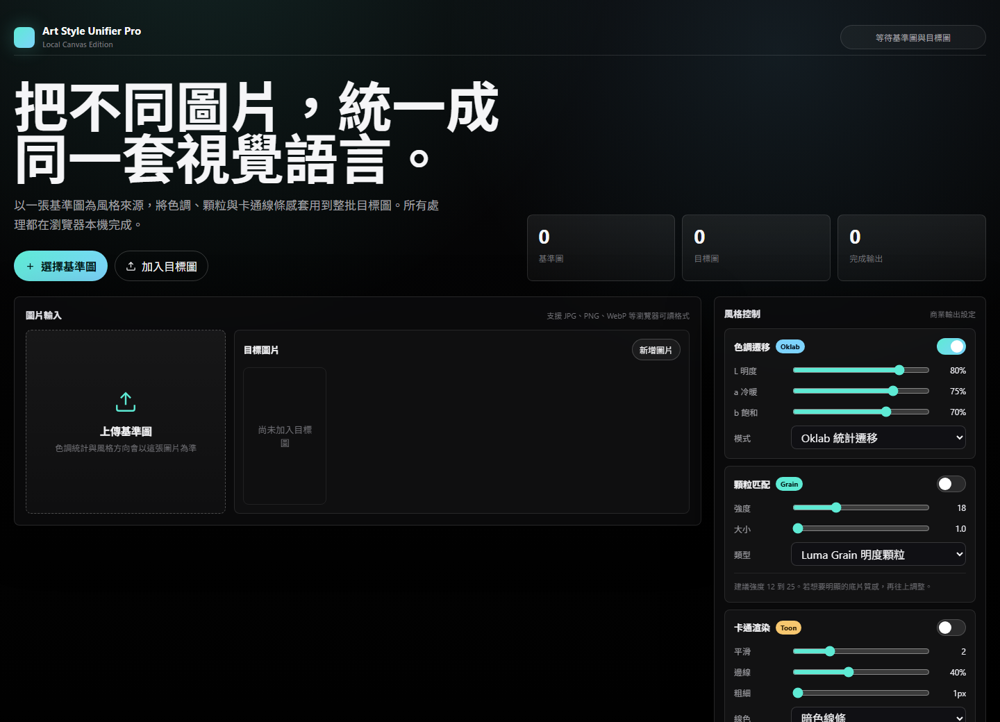
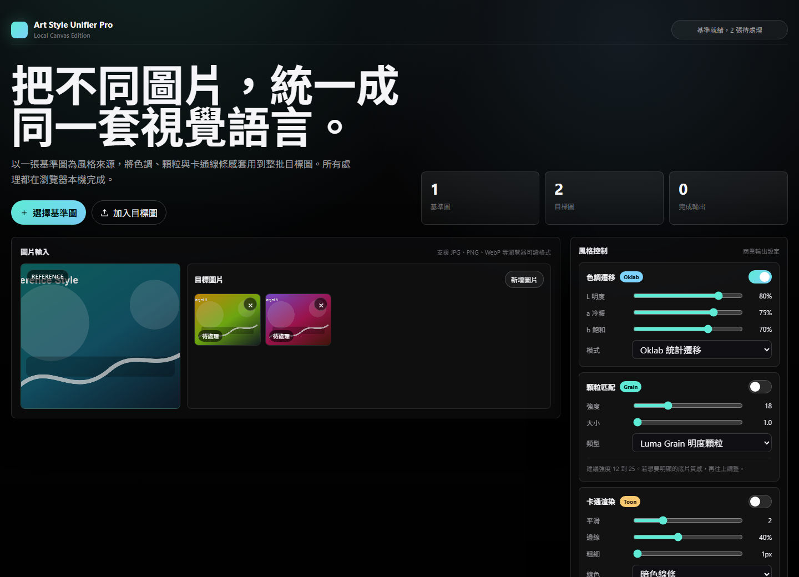
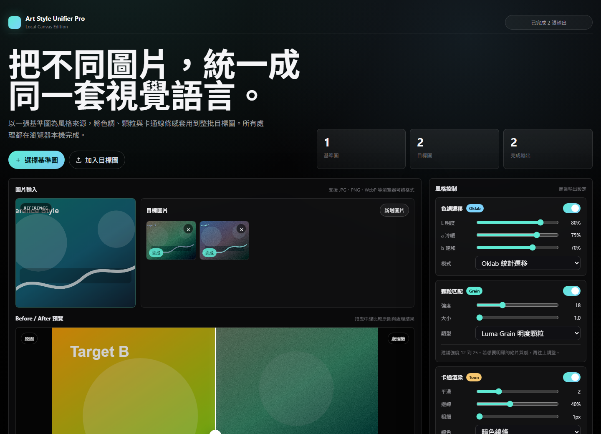
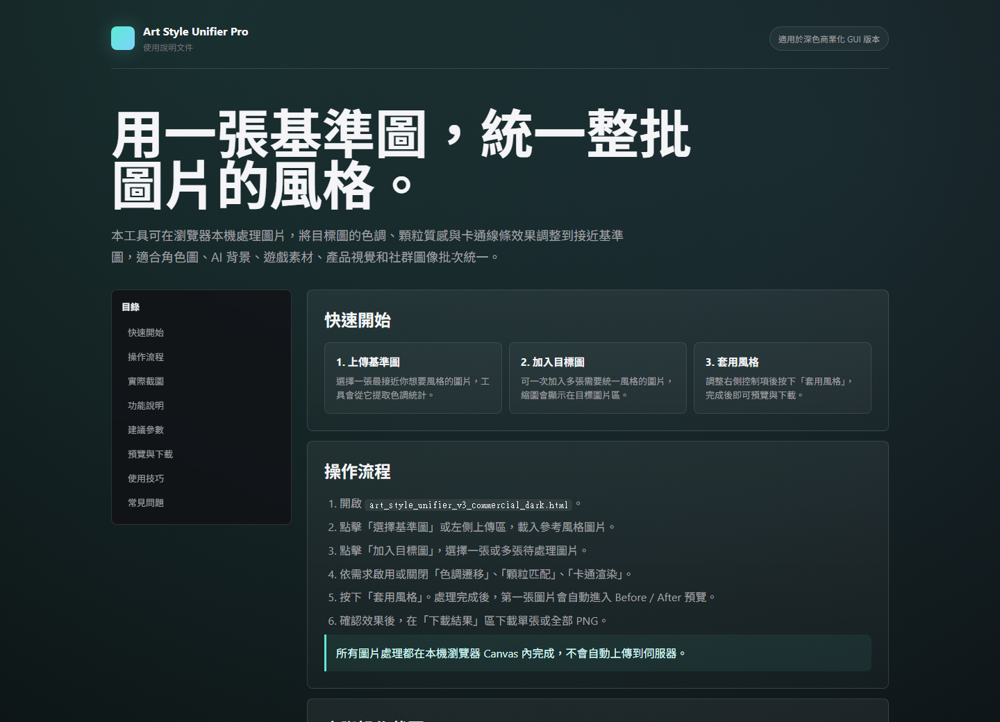

# Art Style Unifier Pro

深色商業化介面的本機圖片風格統一工具。

## 功能

- 以一張基準圖統一多張目標圖的視覺風格
- Oklab 色調統計遷移與直方圖匹配
- 顆粒匹配與底片光暈效果
- Surface Blur + Sobel 卡通線條後處理
- Before / After 拖曳分割預覽
- PNG 單張或批次下載
- 多語言介面：繁體中文、简体中文、English、日本語、한국어

## 使用方式

直接開啟 `index.html`，或啟用 GitHub Pages 後從瀏覽器使用。

右上角可切換介面語言，方便不同地區的使用者閱讀與操作。

完整說明請看 `user_guide.html`。

## 操作截圖

### 1. 開啟工具首頁

### 2. 上傳基準圖與目標圖

### 3. 套用風格並檢視 Before / After

### 4. 查看使用說明

## 隱私

圖片處理在瀏覽器本機 Canvas 內完成，沒有內建伺服器上傳流程。
